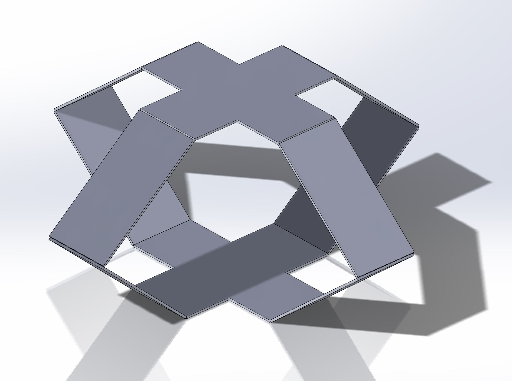

## First version design
The first version of the design is consist of 4 seperated links connected to the top and buttom plate. Since we have to manufacture each arm seperately which is time consuming, we decide to come up with a new design to solve the issue.

## Second version desing
The second version design is a popup mechanism which can  be manufactured in a single piece.

