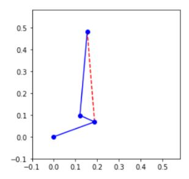

## Solve valid initial condition
An initial plot of the system has been defined as the toe off position during bipedal running. Constants such as those defining the ankle-shank geometry have been established using data from references [3]. The joint angles have been selected from angle range data [1]. An extreme position has been defined to represent toe off events. The system frames have been defined as per the create figure section and the corresponding plot is provided below.

## Plot the system position

