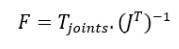
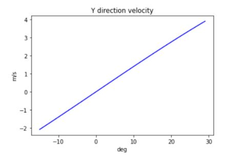
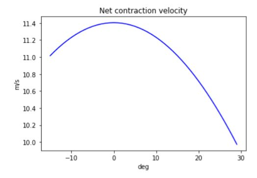

## Solve valid initial condition
An initial plot of the system has been defined as the toe off position during bipedal running. Constants such as those defining the ankle-shank geometry have been established using data from references [3]. The joint angles have been selected from angle range data [1]. An extreme position has been defined to represent toe off events. The system frames have been defined as per the create figure section and the corresponding plot is provided below.

## Plot the system position

The above plot shows the foot-shank pose during the toe-off event. From the position (0,0) onwards, the points are identified as: toe, calcaneus bone, ankle joint, knee. The red dotted line represents a muscle+tendon fiber that actuates ankle dorsiflexion.

## Define force vector
A force vector has been defined according to the vertical and horizontal accelerations of the knee joint. The entire load (mass of the subject + the inertial forces during running) are defined according to the variables: wt, accel_x and accel_y. For an initial reference, vertical acceleration (accel_y) is taken to be = -9.8m/s and the horizontal acceleration is neglected. The toe is constrained to the ground and the force is applied on the knee (end-effector).

## Calculate torque
A holding torque is calculated according to the formula:

The final holding torque at the ankle required to support inertial forces during running are found to be 0.3288Nm/Kg.
Note that the torques have been normalized according to subject weight.

## Estimate velocity
Instead of the velocity of the Knee (considered to be the end effector here), we require the contraction velocity of the muscle fibers. The Knee and Calcaneus points define the start and end of the muscle+tendon fibers.

(Pknee - Pcalc) vector thus defines the muscle fiber. (Pknee - Pcalc).time_derivative provides the contraction velocity. The graphs below show the contraction velocities of the fiber in the X, Y directions and net velocity:

