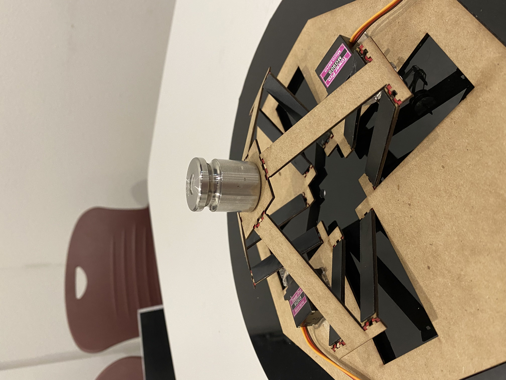

# Project Title: Artificial Muscle for Legged Robots
**Team 3**

|    Name                                |    Email    |
| -----------                            | ----------- |
| Kevin Abishek                          | _kabishek@asu.edu_|
| Mohammad Zaki Patel                    |_mmpate15@asu.edu_ |
| Shih-Heng Chen                         |_schen304@asu.edu_ |

# Home

## Introduction
Legged motion is one of the most demanding movements in mobile robots. Interest in developing an artificial muscle for smooth legged motion.

## Research Question
How can we design an elemental artificial muscle by controlling stiffness and manufacturing material to reproduce the same biomechanical properties as that of muscles involved in human running gait cycle to achieve desired linear motion?

[Link to Research Question](/Researchquestion.md)

## Biomechanics
[Link to Biomechanics](/Biomechanics.md)

## Kinematics
[Link to Kinematics](/systemKinematics.md)

[Link to System Kinematics code](https://nbviewer.org/github/schen304joseph/team3.github.io/blob/475778d9a0861d0e83a10b50010543799e28a476/System_Kinematics.ipynb)

## Dynamics Model I
[Link to System Dynamics model](https://nbviewer.org/github/mmpate15/team3.github.io/blob/Zaki-Patel/Sarrus_DynamicsI.ipynb)

## Parameter Identification Plan
[Link to Parameter Identification Plan](/Parameter_Identification_Plan.md)

[Link to Individual Parameter ID](/Parameter_ID.md)

## Dynamics Model II
[Link to System Dynamics II model](https://nbviewer.org/github/schen304joseph/team3.github.io/blob/99c275d08f8f33cbe7132ef5955b6cf0e5fda2e4/System_Dynamics_II.ipynb)

## Design Optimization for Stiffness
[Link to Stiffness](/Stiffness1.md)

[Link to Design Optimization model](https://nbviewer.org/github/schen304joseph/team3.github.io/blob/fa3052ea6ce89f758028bb9ecda30f4ba1324c7f/Design_Optimization.ipynb)

## Design and Manufacturing Workflow
[Link to Design and Manufacturing code](https://nbviewer.org/github/schen304joseph/team3.github.io/blob/821455b032386fd3cc315a200c63b5272f96a7e0/Manufacturing_Code.ipynb)

## Presentations
[Link to Presentation 1](/Presentation_I.md)

[Link to Presentation 2](/Presentation_2.md)

[Link to Presentation 3](/Presentation_III.md)

## CAD model

[Link to CADmodel](/CADmodel.md)

## Gallery
[Link to Gallery](/Gallery.md)

